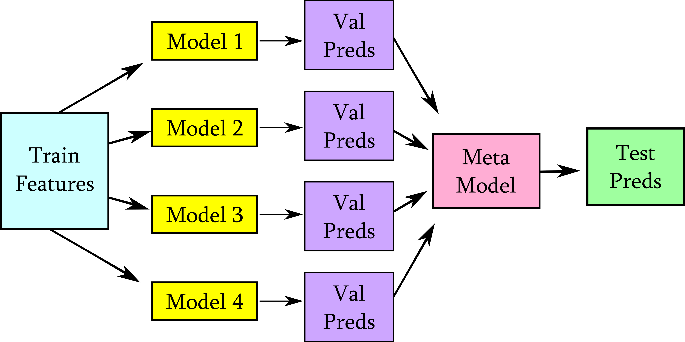
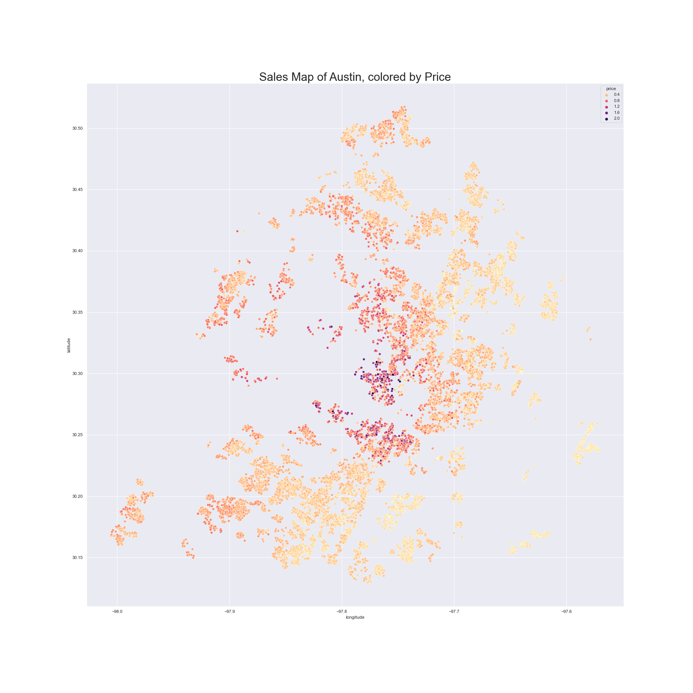
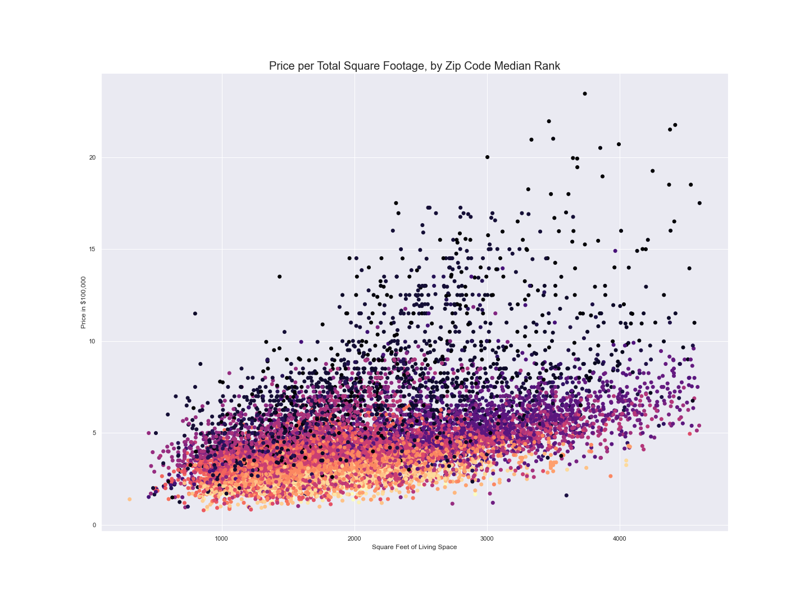

# Austin Housing Price Predictor and Features Study

By: Jen Wadkins

## Introduction

> This is an in-depth notebook which explores the Austin Housing Dataset through several different models. The notebook includes a thorough EDA and cleaning section, numerous visualizations, exploration of different models, feature selection and engineering methods, nlp, neural networks, transfer learning, and model ensembling to create the final model.

> You can read my tutorial about simple model stacking on Medium: https://towardsdatascience.com/simple-model-stacking-explained-and-automated-1b54e4357916

## Skills Presented

* Data Cleaning
* Exploratory Data Analyis
* Data Visualization
* Feature Selection and Engineering
* NLP with TF-IDF
* Model Selection and Tuning
* Neural Network Architecture with Keras and Tensorflow
* NLP Transfer Learning with Standford GloVe
* Image Transfer Learning with Google InceptionV3
* Model Ensembling

## Business Objective and Questions

#### Business Objective

Build a model that accurately predicts house prices in Austin. Determine the importance of various features both in the home and to include in listing descriptions. Use features to inform intelligent photo recommendations.

#### Questions

* What are the primary factors influencing housing prices in the Austin metro area?
* What home elements from the listing descriptions are important to the price?
* Do housing images contribute to predictive power?
* Can we effectively use a regression model based system for realtors to determine a proper list price?
* What additional features would strengthen our model?

## Methodology

We use the OSEMN for Data Science to organize the project.
* Obtain Data: Source data from Zillow
* Scrubbing/Cleaning Data: Clean and prepare data for model processing
* Exploring/Visualizing the Data: Perform EDA on data
* Model: Iteratively explore different models
* Analysis: Analyze and explain results

# Table of Contents

#### [Austin-Keras.ipynb.ipynb](https://github.com/threnjen/austin_housing_prices/blob/main/Austin-Keras.ipynb)

* **Project Overview**

* **Obtaining Our Data**

* **Cleaning Our Data**

* **Visualizing Our Data**

* **Standard Models**

* **Neural Networks**

* **Ensembling**
    
* **Analysis**

* **APPENDIX**

## Analysis

> Our final model utilizes a wide combination of continuous variables, one-hot-encoded categoricals, extracted image features, and extracted word embeddings to produce an ensembled model with a mean absolute error of 56.4k, and a root mean squared error of 94.8k. This MAE is a huge 8.59% improvement over the baseline tabular-only predictions using the best tuned model, with an MAE of 61.7k. The categorical features were processed with a combination of target encoding and one-hot encoding. The text description features were vector embedded using the pre-trained Stanford GloVe 300d word embeddings NLP model. The images were processed using the pre-trained Google InceptionV3 image classification model. The final model was produced using model ensembling which included a mixture of neural networks, standard models, and image/text extracted features from the aforementioned pre-trained GloVe and InceptionV3 models.

##### What are the primary factors influencing housing prices in the Austin metro area?

> Square footage is, unsurprisingly, a key player in house pricing. And as they say, location is everything, and it is the primary influencing factor for a home price in the Austin metro area. Number of bathrooms, school rating, and lot size all contributed a large amount as well.

Scatter of Sales for Austin Geographic area

Price per Square Feet of Living Space

##### What home elements from the listing descriptions are important to the price?

> To determine features that we should highlight in the listings, we determine features that have some relevance to the home price. If they DO exist, these are features that we should definitely mention in our listing descriptions.

> **Home features**: sprinkler system, hardwood, laminate, main (master on the main?), tankless water heater, stainless steel appliances, office, built ins, breakfast bar, washer/dryer, garden tub, wine cellar, gourmet kitchen, original, fire pit, marble

> **Location elements**: areas such as Barton and Zilker, easy access, conveniently located, restaurant, airport, nature, hiking, bike trail, walkable, lake

> **Exterior words**: country, corner lot, view, south (facings), pool

> **Descriptive elements**: natural light (abundance, ton), open concept, move in ready, community, fresh paint, luxury, brand new, condo

##### Do housing images contribute to predictive power?

> The features that we extracted from the InceptionV3 pre-trained model were considered important to the model and were used in the ensemble. Unfortunately, this process results in low explainability, and we're not sure HOW or WHY they were important to the model. Anecdotally however, we know that pictures are important, so we could use what we learn about other important model features to inform the things that we picture in the listings. For example some home features that were important are a fire pit, or a garden tub - ensure that pictures of the bathroom or outdoors centrally show and highlight this feature. For exterior features like a corner lot or a view, get a quality shot that really emphasizes this orientation. And since we know that location is everything and that words such as hiking, biking, walkable are important, take shots if possible that emphasize green space or nature on or near the property. A picture of a walkable local park or community pool for example wouldn't be out of place, and would help highlight descriptors that were flagged as important.

##### Can we effectively use a regression model based system for realtors to determine a proper list price?
> Our model, while explaining about 76% of the price variance with our features, was nonetheless far from accurate in absolute terms. A mean average error of 56.4k in either direction is a huge variance to a home price - one that is so large that it renders the prediction much less meaningful and useful. Other models need to be explored, better data needs to be sourced, or easy-to-use features that an average realtor is capable of evaluating/acquiring should be added to the model to improve its predictive quality. The model is providing at best a baseline starting point.

##### What are the features missing?
> I believe this data set to be missing some key features that have high influence in other housing sets, foremost among them reasonable metrics of home condition, home quality, and neighborhood quality. Other data sets that focus on home prices and include quality of build materials and home condition (see [King County Dataset](https://www.kaggle.com/harlfoxem/housesalesprediction)) can achieve a higher R^2 and lower MAE. We attempted to pick up some of the quality and condition metrics via NLP. While the NLP did contribute to the model, it was insufficient to explain all of these missing metrics.

## Future Work

* Custom generators with Image Data Augmentation - We currently only used image augmentation in the singular NN image model. If I take the time to create and understand custom generators, I could integrate image data augmentation into the multi-input neural network.

* Model Explainability - Image details and information are lacking. We know that images are important, but we don't know how. We could explore other image features methods such as: Getting the dominant colors of an image (looking for green space?), measuring an image's entropy, or pulling satellite imagery of the address via Google and using those images instead or in addition to the MLS images.

* "Snapshot" Ensembling - Creates model snapshots at every local minima which can then be used to add to the ensembling stack. The method involves a cyclical learning rate which has the model "escape" when it reaches a minima and find a new one. Each minima will be looking at the model data in a different way and carry different errors and biases, which is a key strength of model ensembling.

* To take this model to deployment - Instead of using validation set, fit and predict the included predictions types on the entire data set using out-of-fold predictions with a 10-fold, then stack those predictions and fit on those for a final deployment model.

## Presentation
[Video - Data Science Module 4 Project]()

[PDF of Presentation]()
